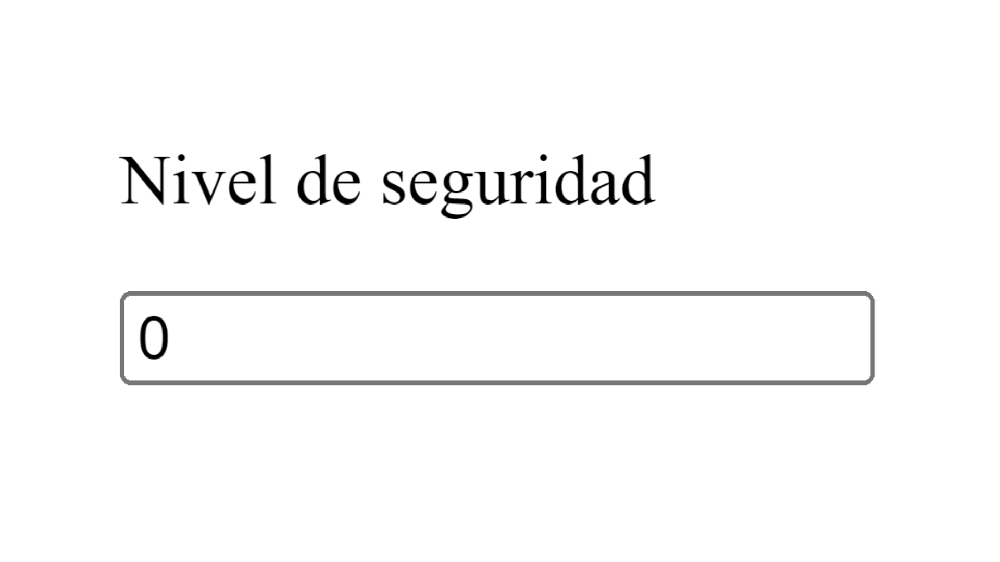
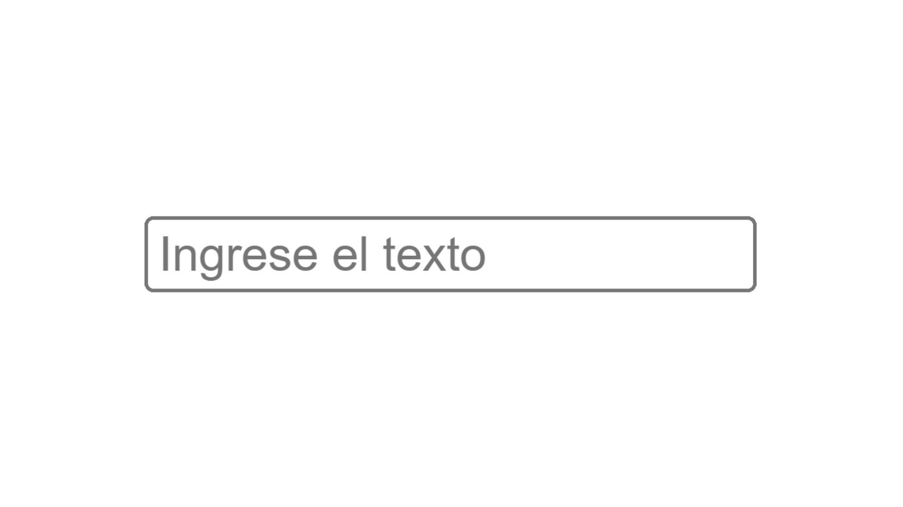
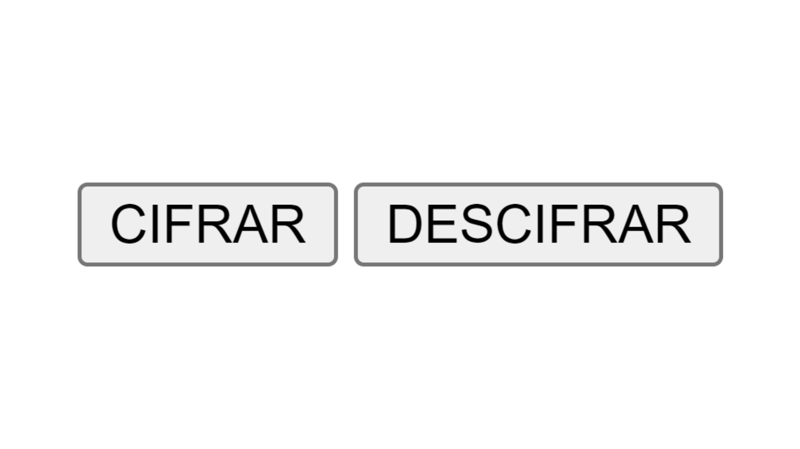

# Cifrado Caesar
## Índice
* [1. Introducción](### 1. Introducción)

* [2. Resumen](### 2. Resumen)

* [3. Información relevante](### 3. Información relevante)

### 1. Introducción
Esta aplicación busca ser la mejor herramienta de cifrado de mensajes, disminuyendo el riesgo de filtración de información. 

### 2. Funcionalidad y diseño
Las principales funciones de la aplicación se desarrollaron en el documento cipher.js, siendo estas: encode() y decode():
```js
encode: (offset, string) => {
    let result="";
      for (let i= 0; i<(string.length); i++){
        console.log("ingrese al for",string.length);
      let codeAscii = string.charCodeAt(i);
      console.log(codeAscii);
         if (codeAscii >=65 && codeAscii <=90){
          result += String.fromCharCode(((codeAscii-65+offset)%26)+65);
         }
    }
    console.log(result);
    return result;
};
```
Ambas funciones, trabajan con dos parámetros: string y offset, declaramos result como un string vacío y procedemos a abrir un bucle, donde contaremos los elementos de uno en uno, empezando desde la posición cero hasta terminar la cadena apoyados por la propiedad length, que nos indica la cantidad de caracteres de la cadena.
Procedemos luego a hacer uso del método [charCodeAt()](http://www.w3bai.com/es/jsref/jsref_charcodeat.html) que devuelve un número que indica el valor Unicode, por cada caracter del string(cadena). 
Esta aplicación trabaja con un subconjunto de Unicode, el código [Ascii](https://elcodigoascii.com.ar/), e incluso un subconjunto del código Ascii, ya que los elementos que admite son los valores que fluctúan entre 65 y 90, representando el abecedario exceptuando la Ñ. 

Procedemos a usar el método [String.fromCharCodeAt()](https://developer.mozilla.org/es/docs/Web/JavaScript/Reference/Global_Objects/String/fromCharCode) que convierte en cadenas los valores de cada caracter obtenido, después de haberle aplicado la fórmula de cifrado. 

Hacemos uso del DOM en nuestro archivo index.js del cual "llamamos" a encode() y decode() para darle funcionalidad a cada uno de nuestros elementos pertenecientes a nuestra estructura htlm: Botones, cajas de texto y cajas de valores.

Por último trabajamos dandole estilo a nuestro aplicativo en nuestro archivo satyle.css

Elegimos un color azul de fondo ya que según la [psicología del color](https://www.damos.co/blog/marketing-y-branding/psicologia-del-color-como-usar-la-teoria-del-color-en-marketing-y-diseno) , representa fuerza, serenidad y confianza, características que queremos transmitir y que también definen, a nuestros usuarios.

Se ideó un diseño amigable y rápido, comprendiendo la premura de nuestros usuarios al momento de escribir los mensajes que deseen cifrar o descifrar. 
Es por ello que la aplicación presenta una caja de valores, donde el usuario elegirá el grado de seguridad para su mensaje, el límite mínimo es cero y no existe un límite máximo:


Codificación correspondiente:
```html
 <p>Nivel de seguridad</p>
    <input type="number" id="desplazamiento" value="0" min="0" width="5"> 
```
Seguidamente, presenta una caja de texto, donde el usuario ingresará el mensaje en cuestion:


Codificación correspondiente:
```html
 <p>Elige entre estas opciones</p><input type="text" id="message1" name="Ingrese el texto" placeholder="Ingrese el texto">
```
También presenta dos botones, el usuario elegirá el que necesite:

Codificación correspondiente:
```html
<p>Elige entre estas opciones</p><input type="text" id="message1" name="Ingrese el texto" placeholder="Ingrese el texto">
    <button type="button" id=btn2>CIFRAR</button>
    <button type="button" id="btn3">DESCIFRAR</button>
```
Por último se adición un botón más que permite copiar el mensaje ya procesado, para darle mayor rapidez de envío a nuestros usuarios.

### 3. Información relevante

###### Principales usuarios
Este proyecto está dirigido a personas u organizaciones que realicen actividades de voluntariado en zonas con alerta de alta intensidad (Conflictos internos, protestas armadas y agudización de la violencia)
En el Perú el [Primer Informe del estado del voluntariado corporativo en el Perú](file:///C:/Users/Jammie/Downloads/Publicaci%C3%B3n%20Voluntariado%20Corporativo%20Final.pdf), nos indica que:

> El rango de edad que más participa en los programas de voluntariado corporativo fluctúa entre los 24 y 30 años. Asimismo, la participación del rango de edad entre 18 y 23 años (practicantes) también resulta significativa. A medida que incrementa la edad, se reduce la participación. 

Añadimos también que según el informe ya mencionado y también en [El informe sobre el estado del voluntariado en el mundo,](https://www.unv.org/sites/default/files/21337%20-%20SWVR%20report%20-%20SPANISH%20-%20web%20single%20pages_1.pdf) el género con mayor participación es la femenina. 
Teniendo ambos aspectos en consideración optamos por una imagen central basada en un adulto joven, con el rostro cubierto, permitiendo al usuario definir su género.

###### Objetivos del usuario respecto a la aplicación
- Seguridad
- Confiabilidad
- Dinámico
- Rápido
- Amigable
###### Problemas que resuelve la aplicación
Incrementa la posibilidad de acceder a una comunicación efectiva, contextualizada y honesta, disminuyendo el temor de que el mensaje sea utilizada para própositos mal intencionados.